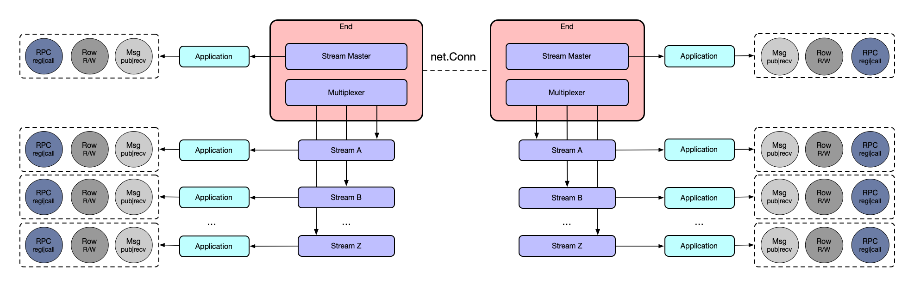

<p align=center>

</p>

<div align="center">

[](https://pkg.go.dev/github.com/singchia/geminio)
[](https://goreportcard.com/report/github.com/singchia/geminio)
[](https://opensource.org/licenses/Apache-2.0)


English | [简体中文](./README_cn.md)

</div>

## Introduction

Geminio is a library that provides **application-layer** network programming, named after [Doubling_Charm](https://harrypotter.fandom.com/wiki/Doubling_Charm).

This library can make network development much easier with comprehensive capabilities like _**RPC**_, _**bidirectional-RPC**_, _**messager**_, _**multi-sessions**_, _**multiplexing**_ and still _**raw-connections**_.

## Architecture



### Interfaces

Most of the library's abstractions are defined in the `geminio.go` file. You can understand the library's concepts by starting from `End` and combining it with the architecture diagram above. Alternatively, you can jump to the usage section below and directly look at the examples.

```golang
type RPCer interface {
	NewRequest(data []byte, opts ...*options.NewRequestOptions) Request
	Call(ctx context.Context, method string, req Request, opts ...*options.CallOptions) (Response, error)
	CallAsync(ctx context.Context, method string, req Request, ch chan *Call, opts ...*options.CallOptions) (*Call, error)
	Register(ctx context.Context, method string, rpc RPC) error
}

type Messager interface {
	NewMessage(data []byte, opts ...*options.NewMessageOptions) Message
    
	Publish(ctx context.Context, msg Message, opts ...*options.PublishOptions) error
	PublishAsync(ctx context.Context, msg Message, ch chan *Publish, opts ...*options.PublishOptions) (*Publish, error)
	Receive(ctx context.Context) (Message, error)
}

type Raw net.Conn

type RawRPCMessager interface {
    // raw
    Raw
    // rpc
    RPCer
    // message
    Messager
}

type Stream interface {
    // a stream is a geminio
    RawRPCMessager
    // meta info for a stream
    StreamID() uint64
    ClientID() uint64
    Meta() []byte
}
    
// Stream multiplexer
type Multiplexer interface {
    OpenStream(opts ...*options.OpenStreamOptions) (Stream, error)
    AcceptStream() (Stream, error)
    ListStreams() []Stream
}
    
type End interface {
    // End is the entry for everything, and it's also a default stream with streamID 1
    Stream
    // End is a stream multiplexer
    Multiplexer
    // Close will close all from the End
    Close()
}
```

## Features

* **Basic RPC** (registration and invocation)
* **Bidirectional RPC** (registration and invocation on both ends)
* **Message send and acknowledgment** (message consistency guarantee)
* **Synchronous/Asynchronous messaging** (waiting for return, asynchronous waiting)
* **Connection multiplexing** (abstract countless TCP/UDP connections on a single connection)
* **Connection identification** (unique ClientID and StreamID)
* **Native net package compatibility** (support for abstracting net.Conn and net.Listener)
* **High availability** (client's continuous reconnection mechanism)
* **Extensive testing** (stress testing, chaos testing, runtime PProf analysis, etc.)
* ...

## Usage

All usage examples can be found [here](./examples/usage).

### Message

**server:**

```golang
package main

import (
    "context"

    "github.com/jumboframes/armorigo/log"
    "github.com/singchia/geminio/server"
)

func main() {
    ln, err := server.Listen("tcp", "127.0.0.1:8080")
    if err != nil {
        log.Errorf("server listen err: %s", err)
        return
    }

    for {
        end, err := ln.AcceptEnd()
        if err != nil {
            log.Errorf("accept err: %s", err)
            break
        }
        go func() {
            msg, err := end.Receive(context.TODO())
            if err != nil {
                return
            }
            log.Infof("end receive: %s", string(msg.Data()))
            msg.Done()
        }()
    }

}
```

**client:**

```golang
package main

import (
    "context"

    "github.com/jumboframes/armorigo/log"
    "github.com/singchia/geminio/client"
)

func main() {
    end, err := client.NewEnd("tcp", "127.0.0.1:8080")
    if err != nil {
        log.Errorf("client dial err: %s", err)
        return
    }
    msg := end.NewMessage([]byte("hello"))
    err = end.Publish(context.TODO(), msg)
    if err != nil {
        log.Errorf("end publish err: %s", err)
        return
    }
    end.Close()
}
```

### RPC

**server:**

```golang
package main

import (
    "context"

    "github.com/jumboframes/armorigo/log"
    "github.com/singchia/geminio"
    "github.com/singchia/geminio/server"
)

func main() {
    ln, err := server.Listen("tcp", "127.0.0.1:8080")
    if err != nil {
        log.Errorf("server listen err: %s", err)
        return
    }

    for {
        end, err := ln.AcceptEnd()
        if err != nil {
            log.Errorf("accept err: %s", err)
            break
        }
        go func() {
            err := end.Register(context.TODO(), "echo", echo)
            if err != nil {
                return
            }
        }()
    }
}

func echo(_ context.Context, req geminio.Request, rsp geminio.Response) {
    rsp.SetData(req.Data())
    log.Info("echo:", string(req.Data()))
}
```

**client:**

```golang
package main

import (
    "context"

    "github.com/jumboframes/armorigo/log"
    "github.com/singchia/geminio/client"
)

func main() {
    opt := client.NewEndOptions()
    opt.SetWaitRemoteRPCs("echo")
    end, err := client.NewEnd("tcp", "127.0.0.1:8080", opt)
    if err != nil {
        log.Errorf("client dial err: %s", err)
        return
    }
    rsp, err := end.Call(context.TODO(), "echo", end.NewRequest([]byte("hello")))
    if err != nil {
        log.Errorf("end call err: %s", err)
        return
    }
    if string(rsp.Data()) != "hello" {
        log.Fatal("wrong echo", string(rsp.Data()))
    }
    log.Info("echo:", string(rsp.Data()))
    end.Close()
}
```

### Bidirectional RPC

**server:**

```golang
package main

import (
    "context"

    "github.com/jumboframes/armorigo/log"
    "github.com/singchia/geminio"
    "github.com/singchia/geminio/server"
)

func main() {
    opt := server.NewEndOptions()
    // the option means all End from server will wait for the rpc registration
    opt.SetWaitRemoteRPCs("client-echo")
    // pre-register server side method
    opt.SetRegisterLocalRPCs(&geminio.MethodRPC{"server-echo", echo})

    ln, err := server.Listen("tcp", "127.0.0.1:8080", opt)
    if err != nil {
        log.Errorf("server listen err: %s", err)
        return
    }

    for {
        end, err := ln.AcceptEnd()
        if err != nil {
            log.Errorf("accept err: %s", err)
            break
        }
        go func() {
            // call client side method
            rsp, err := end.Call(context.TODO(), "client-echo", end.NewRequest([]byte("foo")))
            if err != nil {
                log.Errorf("end call err: %s", err)
                return
            }
            if string(rsp.Data()) != "foo" {
                log.Fatal("wrong echo", string(rsp.Data()))
            }
            log.Info("client echo:", string(rsp.Data()))
        }()
    }
}

func echo(_ context.Context, req geminio.Request, rsp geminio.Response) {
    rsp.SetData(req.Data())
    log.Info("server echo:", string(req.Data()))
}
```

**clent:**

```golang
package main

import (
    "context"

    "github.com/jumboframes/armorigo/log"
    "github.com/singchia/geminio"
    "github.com/singchia/geminio/client"
)

func main() {
    opt := client.NewEndOptions()
    // the option means all End from server will wait for the rpc registration
    opt.SetWaitRemoteRPCs("server-echo")
    // pre-register client side method
    opt.SetRegisterLocalRPCs(&geminio.MethodRPC{"client-echo", echo})

    end, err := client.NewEnd("tcp", "127.0.0.1:8080", opt)
    if err != nil {
        log.Errorf("client dial err: %s", err)
        return
    }
    // call server side method
    rsp, err := end.Call(context.TODO(), "server-echo", end.NewRequest([]byte("bar")))
    if err != nil {
        log.Errorf("end call err: %s", err)
        return
    }
    if string(rsp.Data()) != "bar" {
        log.Fatal("wrong echo", string(rsp.Data()))
    }
    log.Info("server echo:", string(rsp.Data()))
    end.Close()
}

func echo(_ context.Context, req geminio.Request, rsp geminio.Response) {
    rsp.SetData(req.Data())
    log.Info("client echo:", string(req.Data()))
}
```

### Multiplexer

**server:**

```golang
package main

import (
    "github.com/jumboframes/armorigo/log"
    "github.com/singchia/geminio/server"
)

func main() {
    ln, err := server.Listen("tcp", "127.0.0.1:8080")
    if err != nil {
        log.Errorf("server listen err: %s", err)
        return
    }

    for {
        end, err := ln.AcceptEnd()
        if err != nil {
            log.Errorf("accept err: %s", err)
            break
        }
        // stream #1, and it's also a net.Conn
        sm1, err := end.OpenStream()
        if err != nil {
            log.Errorf("end open stream err: %s", err)
            break
        }
        sm1.Write([]byte("hello#1"))
        sm1.Close()

        // stream #2 and it's also a net.Conn
        sm2, err := end.OpenStream()
        if err != nil {
            log.Errorf("end open stream err: %s", err)
            break
        }
        sm2.Write([]byte("hello#2"))
        sm2.Close()
    }
}
```

**client:**

```golang
package main

import (
    "net"

    "github.com/jumboframes/armorigo/log"
    "github.com/singchia/geminio/client"
)

func main() {
    end, err := client.NewEnd("tcp", "127.0.0.1:8080")
    if err != nil {
        log.Errorf("client dial err: %s", err)
        return
    }
    // the end is also a net.Listener
    ln := net.Listener(end)
    for {
        conn, err := ln.Accept()
        if err != nil {
            log.Errorf("end accept err: %s", err)
            break
        }
        go func(conn net.Conn) {
            buf := make([]byte, 128)
            _, err := conn.Read(buf)
            if err != nil {
                return
            }
            log.Info("read:", string(buf))
        }(conn)
    }
    end.Close()
}
```

## Examples

* **Message and Acknowledgment** [messager](./examples/messager)
* **Message Queue** [mq](./examples/mq)
* **Chatroom** [chatroom](./examples/chatroom)
* **Relay** [relay](./examples/relay)
* **Intranet Penetration** [traversal](./examples/traversal)


## Test

### Benchmarks

```
goos: darwin
goarch: amd64
pkg: github.com/singchia/geminio/test/bench
cpu: Intel(R) Core(TM) i5-6267U CPU @ 2.90GHz
BenchmarkMessage-4   	   10117	    112584 ns/op	1164.21 MB/s	    5764 B/op	     181 allocs/op
BenchmarkEnd-4       	   11644	     98586 ns/op	1329.52 MB/s	  550534 B/op	      73 allocs/op
BenchmarkStream-4    	   12301	     96955 ns/op	1351.88 MB/s	  550605 B/op	      82 allocs/op
BenchmarkRPC-4       	    6960	    165384 ns/op	 792.53 MB/s	   38381 B/op	     187 allocs/op
PASS
```

## Design

This library is implemented based on the following architecture

<p align=center>

</p>

## Contributing
If you find any bugs, please submit the issue, we will respond in a short time.
 
If you want to contribute new features or help solve project problems, please feel free to submit a PR:
 
 * Maintain consistent code style
 * Submit one feature at a time
 * Include unit tests with the code you submit

<!-- Copy-paste in your Readme.md file -->

<a href="https://next.ossinsight.io/widgets/official/compose-activity-trends?repo_id=412119706" target="_blank" style="display: block" align="center">
  <picture>
    <source media="(prefers-color-scheme: dark)" srcset="https://next.ossinsight.io/widgets/official/compose-activity-trends/thumbnail.png?repo_id=412119706&image_size=auto&color_scheme=dark" width="815" height="auto">
    
  </picture>
</a>

<!-- Made with [OSS Insight](https://ossinsight.io/) -->

## License

© Austin Zhai, 2023-2030

Released under the [Apache License 2.0](https://github.com/singchia/geminio/blob/main/LICENSE)
