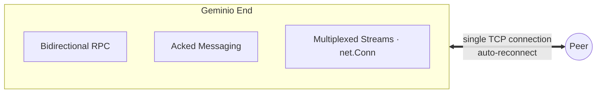

<div align="center">


**One connection. Bidirectional RPC, acked messaging, and stream multiplexing — behind a single `net.Conn`.**

[](https://pkg.go.dev/github.com/singchia/geminio)
[](https://goreportcard.com/report/github.com/singchia/geminio)
[](https://opensource.org/licenses/Apache-2.0)
[](https://github.com/singchia/geminio)

[English](./README.md) | [简体中文](./README_cn.md)

</div>

---

## Why Geminio?

You're building an IM server, a message queue, an API gateway, a reverse tunnel for NAT traversal, or a service-mesh sidecar. To get it right you need **bidirectional RPC**, **reliable messaging with acks**, **many logical streams over one TCP connection**, **automatic reconnect**, and all of it has to play nicely with Go's `net.Conn` / `net.Listener`.

The usual answer is: gRPC for RPC, yamux/smux for multiplexing, NATS or a custom protocol for messaging, and a tangle of glue to keep their lifecycles in sync. **Geminio offers the whole bundle behind one interface.**


```mermaid
flowchart LR
    subgraph End["Geminio End"]
      direction TB
      RPC["Bidirectional RPC"]
      MSG["Acked Messaging"]
      RAW["Multiplexed Streams · net.Conn"]
    end
    End <==>|"single TCP connection<br/>auto-reconnect"| Peer(("Peer"))
```

## Geminio vs. the usual suspects

|                                       | gRPC              | yamux / smux | NATS | **Geminio** |
| ------------------------------------- |:-----------------:|:------------:|:----:|:-----------:|
| Request / response RPC                | ✅                | —            | —    | ✅          |
| **Server-initiated RPC to client**    | ⚠️ streaming only | —            | —    | ✅          |
| Messaging with publish/ack            | —                 | —            | ✅   | ✅          |
| Stream multiplexing                   | ✅ (HTTP/2)       | ✅           | —    | ✅          |
| Drop-in `net.Conn` / `net.Listener`   | —                 | ✅           | —    | ✅          |
| Client-side auto-reconnect            | —                 | —            | ✅   | ✅          |
| Single binary, no broker              | ✅                | ✅           | —    | ✅          |

> "Server-initiated RPC" means the server can `Call("method", ...)` a handler the client registered — not just push messages on an open stream. It's the piece most "RPC libraries" don't ship.

## Features

- 🔄 **Bidirectional RPC** — either side can register methods and call the other's.
- 📨 **Acked messaging** — `Publish` / `Receive` with delivery confirmation; sync and async.
- 🔀 **Stream multiplexing** — open any number of logical streams over one connection.
- 🔌 **`net.Conn` / `net.Listener` compatible** — streams drop into any code that speaks Go's net interfaces.
- 🆔 **Stable peer & stream IDs** — `ClientID` and `StreamID` make routing, authz, and tracing straightforward.
- 🔁 **Auto-reconnect** — client resumes transparently after network blips.
- ⚡ **~1.3 GB/s** stream throughput on a 2016 laptop CPU (see [Benchmarks](#benchmarks)).
- 🧪 **Hardened** — unit, integration, e2e, stress, chaos, and regression test suites.

## 60-second demo

```bash
go get github.com/singchia/geminio
```

**Server**

```go
ln, _ := server.Listen("tcp", "127.0.0.1:8080")
for {
    end, _ := ln.AcceptEnd()
    end.Register(context.TODO(), "echo", func(_ context.Context, req geminio.Request, rsp geminio.Response) {
        rsp.SetData(req.Data())
    })
}
```

**Client**

```go
opt := client.NewEndOptions()
opt.SetWaitRemoteRPCs("echo")

end, _ := client.NewEnd("tcp", "127.0.0.1:8080", opt)
defer end.Close()

rsp, _ := end.Call(context.TODO(), "echo", end.NewRequest([]byte("hello")))
fmt.Println(string(rsp.Data())) // => hello
```

No proto files. No code generation. No broker. Full examples in [`docs/USAGE.md`](./docs/USAGE.md).

## What you can build

| Scenario | Why Geminio fits | Example |
| --- | --- | --- |
| **NAT traversal / reverse tunnel** | one outbound connection carries bidirectional control + many data streams | [`examples/traversal`](./examples/traversal) |
| **Chatroom / IM** | acked messaging, per-client IDs, auto-reconnect | [`examples/chatroom`](./examples/chatroom) |
| **Message queue** | topics, ack, async publish | [`examples/mq`](./examples/mq) |
| **TCP relay / proxy** | `net.Conn`-compatible streams over a control plane | [`examples/relay`](./examples/relay) |
| **API gateway / sidecar** | bidirectional RPC + multiplexing + client identity | build directly on `End` |

## Architecture

<p align="center"></p>

Three layers — **Connection** (physical TCP, heartbeat, FSM), **Multiplexer / Dialogue** (logical streams, routing, write scheduling), and **Application** (RPC and messaging semantics) — let Geminio ship one unified `End` while keeping each concern isolated and testable. Deep dive in [`多路复用原理.md`](./多路复用原理.md).

## Benchmarks

Intel Core i5-6267U @ 2.90 GHz (2016 dual-core laptop):

```
BenchmarkMessage-4     10117   112584 ns/op   1164 MB/s
BenchmarkEnd-4         11644    98586 ns/op   1329 MB/s
BenchmarkStream-4      12301    96955 ns/op   1351 MB/s
BenchmarkRPC-4          6960   165384 ns/op    792 MB/s
```

~1.3 GB/s on streams, ~790 MB/s on end-to-end RPC round-trips — on a ten-year-old laptop CPU. Run `make bench` on your own box.

## Documentation

- **Usage guide** — [`docs/USAGE.md`](./docs/USAGE.md) ([中文](./docs/USAGE_cn.md))
- **API reference** — [pkg.go.dev/github.com/singchia/geminio](https://pkg.go.dev/github.com/singchia/geminio)
- **Runnable examples** — [`examples/`](./examples)
- **Design deep dive** — [`多路复用原理.md`](./多路复用原理.md)
- **Roadmap** — [`ROADMAP.md`](./ROADMAP.md)

## Contributing

PRs and issues are welcome. See [CONTRIBUTING.md](./CONTRIBUTING.md). In short: one feature per PR, tests alongside code, run `make test` before submitting.

## License

Apache 2.0 — © Austin Zhai, 2023–2030.

---

<div align="center">

<a href="https://next.ossinsight.io/widgets/official/compose-activity-trends?repo_id=412119706" target="_blank" style="display: block" align="center">
  <picture>
    <source media="(prefers-color-scheme: dark)" srcset="https://next.ossinsight.io/widgets/official/compose-activity-trends/thumbnail.png?repo_id=412119706&image_size=auto&color_scheme=dark" width="815" height="auto">
    
  </picture>
</a>

Made with [OSS Insight](https://ossinsight.io/)

</div>
