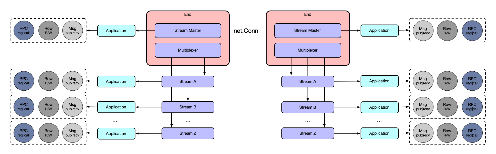

<div align="center">


# Geminio

> 强大的 Go 应用层网络编程库

[](https://pkg.go.dev/github.com/singchia/geminio)
[](https://goreportcard.com/report/github.com/singchia/geminio)
[](https://opensource.org/licenses/Apache-2.0)
[](https://github.com/singchia/geminio)

[English](./README.md) | [简体中文](./README_cn.md)

</div>

---

## 📖 介绍

**Geminio** 是一个功能全面的 Go 应用层网络编程库，命名取自《哈利波特》中的[复制咒语](https://harrypotter.fandom.com/wiki/Doubling_Charm)（Geminio）。它提供了统一的接口来构建网络应用，支持 RPC、双向 RPC、消息传递、多会话管理、连接多路复用和原始连接处理等功能。

Geminio 通过抽象底层网络编程的复杂性来简化网络开发，让开发者能够专注于业务逻辑而非连接管理。

这个库的诞生是因为市面上缺少如双向 RPC、消息收发确认、裸连接管理、多会话和多路复用等综合能力的库，而我们在开发消息队列、即时通讯、接入层网关、内网穿透、代理等应用软件或中间件时都严重依赖这些抽象，故此开发了这个网络程序库，以能够让上层软件开发十分轻松。

## ✨ 特性

- 🔄 **RPC & 双向 RPC** - 完整支持远程过程调用，具备双向调用能力
- 📨 **消息传递** - 可靠的消息传递，提供确认保证
- 🔀 **连接多路复用** - 在单个物理连接上建立多个逻辑连接
- 🆔 **连接标识** - 唯一的 ClientID 和 StreamID 用于连接管理
- 🔌 **原生兼容** - 与 Go 的 `net.Conn` 和 `net.Listener` 无缝集成
- 🔁 **高可用性** - 内置客户端自动重连机制
- ⚡ **高性能** - 针对低延迟和高吞吐量优化
- 🛡️ **生产就绪** - 包含压力测试、混沌测试和性能分析的全面测试
- 📦 **零依赖** - 轻量级，最小化外部依赖

## 🚀 快速开始

### 安装

```bash
go get github.com/singchia/geminio
```

### 基础示例

**服务端：**

```go
package main

import (
    "context"
    "log"

    "github.com/singchia/geminio/server"
)

func main() {
    ln, err := server.Listen("tcp", "127.0.0.1:8080")
    if err != nil {
        log.Fatal(err)
    }

    for {
        end, err := ln.AcceptEnd()
        if err != nil {
            log.Fatal(err)
        }
        
        go func() {
            msg, err := end.Receive(context.TODO())
            if err != nil {
                return
            }
            log.Printf("收到消息: %s", string(msg.Data()))
            msg.Done()
        }()
    }
}
```

**客户端：**

```go
package main

import (
    "context"
    "log"

    "github.com/singchia/geminio/client"
)

func main() {
    end, err := client.NewEnd("tcp", "127.0.0.1:8080")
    if err != nil {
        log.Fatal(err)
    }
    defer end.Close()

    msg := end.NewMessage([]byte("Hello, Geminio!"))
    if err := end.Publish(context.TODO(), msg); err != nil {
        log.Fatal(err)
    }
}
```

## 📚 文档

### 架构

Geminio 采用分层架构设计：



### 核心接口

本库的所有抽象基本都在 `geminio.go` 里，从 End 开始结合上面架构图即可理解本库的设计：

```go
// RPC 接口
type RPCer interface {
    NewRequest(data []byte, opts ...*options.NewRequestOptions) Request
    Call(ctx context.Context, method string, req Request, opts ...*options.CallOptions) (Response, error)
    CallAsync(ctx context.Context, method string, req Request, ch chan *Call, opts ...*options.CallOptions) (*Call, error)
    Register(ctx context.Context, method string, rpc RPC) error
}

// 消息接口
type Messager interface {
    NewMessage(data []byte, opts ...*options.NewMessageOptions) Message
    Publish(ctx context.Context, msg Message, opts ...*options.PublishOptions) error
    PublishAsync(ctx context.Context, msg Message, ch chan *Publish, opts ...*options.PublishOptions) (*Publish, error)
    Receive(ctx context.Context) (Message, error)
}

// 流接口（结合了 RPC、消息传递和原始连接）
type Stream interface {
    RawRPCMessager  // RPC + 消息传递 + net.Conn
    StreamID() uint64
    ClientID() uint64
    Meta() []byte
}

// 多路复用器，用于管理多个流
type Multiplexer interface {
    OpenStream(opts ...*options.OpenStreamOptions) (Stream, error)
    AcceptStream() (Stream, error)
    ListStreams() []Stream
}

// End 是主入口点
type End interface {
    Stream      // End 也是默认流（streamID = 1）
    Multiplexer // End 可以管理多个流
    Close()
}
```

## 💡 使用示例

### 消息发布

**服务端：**

```go
package main

import (
    "context"
    "log"

    "github.com/singchia/geminio/server"
)

func main() {
    ln, err := server.Listen("tcp", "127.0.0.1:8080")
    if err != nil {
        log.Fatal(err)
    }

    for {
        end, err := ln.AcceptEnd()
        if err != nil {
            log.Fatal(err)
        }
        
        go func() {
            msg, err := end.Receive(context.TODO())
            if err != nil {
                return
            }
            log.Printf("收到消息: %s", string(msg.Data()))
            msg.Done()
        }()
    }
}
```

**客户端：**

```go
package main

import (
    "context"
    "log"

    "github.com/singchia/geminio/client"
)

func main() {
    end, err := client.NewEnd("tcp", "127.0.0.1:8080")
    if err != nil {
        log.Fatal(err)
    }
    defer end.Close()

    msg := end.NewMessage([]byte("hello"))
    if err := end.Publish(context.TODO(), msg); err != nil {
        log.Fatal(err)
    }
}
```

### RPC

**服务端：**

```go
package main

import (
    "context"
    "log"

    "github.com/singchia/geminio"
    "github.com/singchia/geminio/server"
)

func main() {
    ln, err := server.Listen("tcp", "127.0.0.1:8080")
    if err != nil {
        log.Fatal(err)
    }

    for {
        end, err := ln.AcceptEnd()
        if err != nil {
            log.Fatal(err)
        }
        
        go func() {
            err := end.Register(context.TODO(), "echo", echo)
            if err != nil {
                log.Fatal(err)
            }
        }()
    }
}

func echo(_ context.Context, req geminio.Request, rsp geminio.Response) {
    rsp.SetData(req.Data())
    log.Printf("Echo: %s", string(req.Data()))
}
```

**客户端：**

```go
package main

import (
    "context"
    "log"

    "github.com/singchia/geminio/client"
)

func main() {
    opt := client.NewEndOptions()
    opt.SetWaitRemoteRPCs("echo")
    
    end, err := client.NewEnd("tcp", "127.0.0.1:8080", opt)
    if err != nil {
        log.Fatal(err)
    }
    defer end.Close()

    rsp, err := end.Call(context.TODO(), "echo", end.NewRequest([]byte("hello")))
    if err != nil {
        log.Fatal(err)
    }
    
    log.Printf("响应: %s", string(rsp.Data()))
}
```

### 双向 RPC

**服务端：**

```go
package main

import (
    "context"
    "log"

    "github.com/singchia/geminio"
    "github.com/singchia/geminio/server"
)

func main() {
    opt := server.NewEndOptions()
    opt.SetWaitRemoteRPCs("client-echo")
    opt.SetRegisterLocalRPCs(&geminio.MethodRPC{"server-echo", echo})

    ln, err := server.Listen("tcp", "127.0.0.1:8080", opt)
    if err != nil {
        log.Fatal(err)
    }

    for {
        end, err := ln.AcceptEnd()
        if err != nil {
            log.Fatal(err)
        }
        
        go func() {
            rsp, err := end.Call(context.TODO(), "client-echo", end.NewRequest([]byte("foo")))
            if err != nil {
                log.Fatal(err)
            }
            log.Printf("客户端 echo: %s", string(rsp.Data()))
        }()
    }
}

func echo(_ context.Context, req geminio.Request, rsp geminio.Response) {
    rsp.SetData(req.Data())
    log.Printf("服务端 echo: %s", string(req.Data()))
}
```

**客户端：**

```go
package main

import (
    "context"
    "log"

    "github.com/singchia/geminio"
    "github.com/singchia/geminio/client"
)

func main() {
    opt := client.NewEndOptions()
    opt.SetWaitRemoteRPCs("server-echo")
    opt.SetRegisterLocalRPCs(&geminio.MethodRPC{"client-echo", echo})

    end, err := client.NewEnd("tcp", "127.0.0.1:8080", opt)
    if err != nil {
        log.Fatal(err)
    }
    defer end.Close()

    rsp, err := end.Call(context.TODO(), "server-echo", end.NewRequest([]byte("bar")))
    if err != nil {
        log.Fatal(err)
    }
    
    log.Printf("服务端 echo: %s", string(rsp.Data()))
}

func echo(_ context.Context, req geminio.Request, rsp geminio.Response) {
    rsp.SetData(req.Data())
    log.Printf("客户端 echo: %s", string(req.Data()))
}
```

### 多路复用

**服务端：**

```go
package main

import (
    "log"

    "github.com/singchia/geminio/server"
)

func main() {
    ln, err := server.Listen("tcp", "127.0.0.1:8080")
    if err != nil {
        log.Fatal(err)
    }

    for {
        end, err := ln.AcceptEnd()
        if err != nil {
            log.Fatal(err)
        }
        
        // 打开流 #1
        sm1, err := end.OpenStream()
        if err != nil {
            log.Fatal(err)
        }
        sm1.Write([]byte("hello#1"))
        sm1.Close()

        // 打开流 #2
        sm2, err := end.OpenStream()
        if err != nil {
            log.Fatal(err)
        }
        sm2.Write([]byte("hello#2"))
        sm2.Close()
    }
}
```

**客户端：**

```go
package main

import (
    "net"
    "log"

    "github.com/singchia/geminio/client"
)

func main() {
    end, err := client.NewEnd("tcp", "127.0.0.1:8080")
    if err != nil {
        log.Fatal(err)
    }
    defer end.Close()

    // End 可以作为 net.Listener 使用
    ln := net.Listener(end)
    for {
        conn, err := ln.Accept()
        if err != nil {
            log.Fatal(err)
        }
        
        go func(conn net.Conn) {
            buf := make([]byte, 128)
            n, err := conn.Read(buf)
            if err != nil {
                return
            }
            log.Printf("读取: %s", string(buf[:n]))
        }(conn)
    }
}
```

## 📦 更多示例

查看 [examples](./examples) 目录获取更多完整示例：

- **[消息传递](./examples/messager)** - 带确认的消息发布和接收
- **[消息队列](./examples/mq)** - 简单的消息队列实现
- **[聊天室](./examples/chatroom)** - 实时聊天室示例
- **[中继器](./examples/relay)** - 网络中继代理
- **[内网穿透](./examples/traversal)** - NAT 穿透示例

## ⚡ 性能

基准测试结果（Intel Core i5-6267U @ 2.90GHz）：

```
goos: darwin
goarch: amd64
pkg: github.com/singchia/geminio/test/bench
cpu: Intel(R) Core(TM) i5-6267U CPU @ 2.90GHz

BenchmarkMessage-4   	   10117	    112584 ns/op	1164.21 MB/s	    5764 B/op	     181 allocs/op
BenchmarkEnd-4       	   11644	     98586 ns/op	1329.52 MB/s	  550534 B/op	      73 allocs/op
BenchmarkStream-4    	   12301	     96955 ns/op	1351.88 MB/s	  550605 B/op	      82 allocs/op
BenchmarkRPC-4       	    6960	    165384 ns/op	 792.53 MB/s	   38381 B/op	     187 allocs/op
```

## 🏗️ 设计

Geminio 采用分层架构实现：

<p align="center">

</p>

## 🤝 参与开发

欢迎贡献！请随时提交 Pull Request。

### 开发指南

- 保持一致的代码风格
- 每次提交一个功能
- 提交的代码都携带单元测试
- 根据需要更新文档

如果发现任何 Bug 或希望提交功能请求，请在 GitHub 上提交 Issue。

## 📄 许可证

版权所有 © Austin Zhai, 2023-2030

基于 [Apache License 2.0](./LICENSE) 许可

---

<div align="center">

<a href="https://next.ossinsight.io/widgets/official/compose-activity-trends?repo_id=412119706" target="_blank" style="display: block" align="center">
  <picture>
    <source media="(prefers-color-scheme: dark)" srcset="https://next.ossinsight.io/widgets/official/compose-activity-trends/thumbnail.png?repo_id=412119706&image_size=auto&color_scheme=dark" width="815" height="auto">
    
  </picture>
</a>

Made with [OSS Insight](https://ossinsight.io/)

</div>
