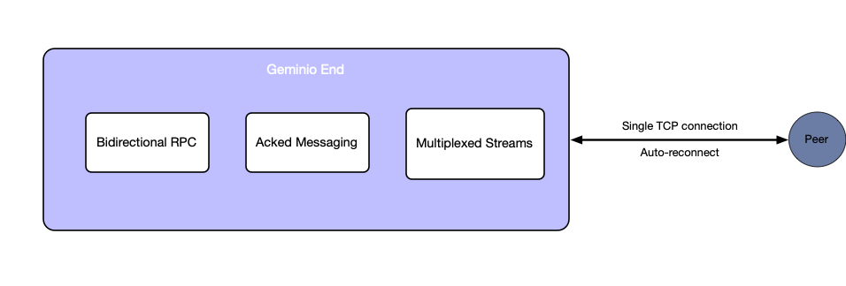
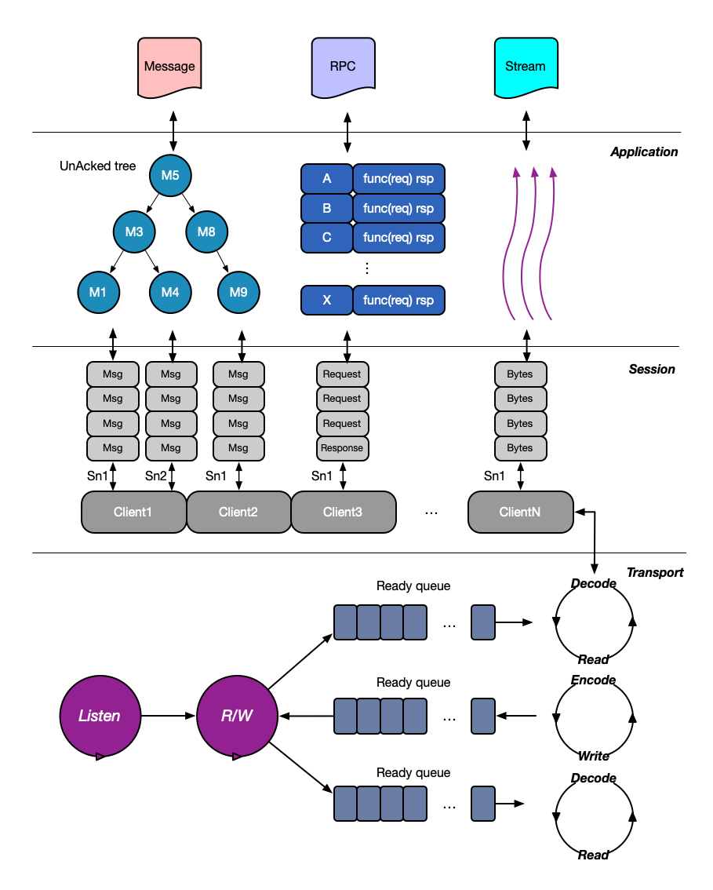

<div align="center">


**Una sola conexión. RPC bidireccional, mensajería con confirmación y multiplexación de streams — detrás de un único `net.Conn`.**

[](https://pkg.go.dev/github.com/singchia/geminio)
[](https://goreportcard.com/report/github.com/singchia/geminio)
[](https://opensource.org/licenses/Apache-2.0)
[](https://github.com/singchia/geminio)

[English](./README.md) | [简体中文](./README_cn.md) | [日本語](./README_ja.md) | [한국어](./README_ko.md) | [Español](./README_es.md) | [Français](./README_fr.md) | [Deutsch](./README_de.md)

</div>

---

## ¿Por qué Geminio?

Estás construyendo un servidor de IM, una cola de mensajes, un API gateway, un túnel inverso para atravesar NAT, o un sidecar de service mesh. Para hacerlo bien necesitas **RPC bidireccional**, **mensajería fiable con acks**, **varios streams lógicos sobre una única conexión TCP**, **reconexión automática**, y que todo encaje con `net.Conn` / `net.Listener` de Go.

La respuesta habitual es: gRPC para RPC, yamux/smux para multiplexación, NATS o un protocolo propio para mensajería, y una maraña de código de pegado que mantenga sus ciclos de vida sincronizados. **Geminio ofrece todo el paquete detrás de una sola interfaz.**

<p align="center"></p>

## Geminio frente a las alternativas habituales

|                                       | gRPC              | yamux / smux | NATS | **Geminio** |
| ------------------------------------- |:-----------------:|:------------:|:----:|:-----------:|
| RPC petición / respuesta              | ✅                | —            | —    | ✅          |
| **RPC iniciado desde el servidor**    | ⚠️ sólo streaming  | —            | —    | ✅          |
| Mensajería publish/ack                | —                 | —            | ✅   | ✅          |
| Multiplexación de streams             | ✅ (HTTP/2)       | ✅           | —    | ✅          |
| Compatible con `net.Conn` / `net.Listener` | —            | ✅           | —    | ✅          |
| Reconexión automática del cliente     | —                 | —            | ✅   | ✅          |
| Binario único, sin broker             | ✅                | ✅           | —    | ✅          |

> "RPC iniciado desde el servidor" significa que el servidor puede ejecutar `Call("método", ...)` sobre un handler que el cliente registró — no sólo empujar mensajes por un stream abierto. Es la pieza que la mayoría de las "librerías de RPC" no trae de fábrica.

## Características

- 🔄 **RPC bidireccional** — cualquiera de las dos partes registra métodos y llama a los del otro.
- 📨 **Mensajería con ack** — `Publish` / `Receive` con confirmación de entrega; síncrono y asíncrono.
- 🔀 **Multiplexación de streams** — abre cuantos streams lógicos quieras sobre una conexión.
- 🔌 **Compatible con `net.Conn` / `net.Listener`** — los streams encajan en cualquier código que hable las interfaces net de Go.
- 🆔 **IDs estables de peer y de stream** — `ClientID` y `StreamID` facilitan routing, autorización y tracing.
- 🔁 **Reconexión automática** — el cliente se recupera de forma transparente tras cortes de red.
- ⚡ **~1.3 GB/s** de throughput por stream en una CPU de portátil de 2016 (ver [Benchmarks](#benchmarks)).
- 🧪 **Endurecido** — suites de tests unitarios, de integración, e2e, estrés, caos y regresión.

## Demo de 60 segundos: enviar un archivo del servidor al cliente

```bash
go get github.com/singchia/geminio
```

Cada stream de Geminio es un `net.Conn` y cada `End` es un `net.Listener`. Por eso, enviar un archivo desde el servidor hacia el cliente es simplemente `io.Copy` — sin framing, sin códec, sin broker.

**Servidor** — acepta clientes, abre un stream en sentido inverso y vuelca el archivo dentro.

```go
ln, _ := server.Listen("tcp", "127.0.0.1:8080")
for {
    end, _ := ln.AcceptEnd()
    go func() {
        stream, _ := end.OpenStream()
        defer stream.Close()
        f, _ := os.Open("payload.bin")
        defer f.Close()
        io.Copy(stream, f)
    }()
}
```

**Cliente** — trata el `End` como un `net.Listener` y guarda en disco cada stream entrante.

```go
end, _ := client.NewEnd("tcp", "127.0.0.1:8080")
defer end.Close()
for {
    conn, _ := end.Accept()
    f, _ := os.Create("received.bin")
    io.Copy(f, conn)
    f.Close()
    conn.Close()
}
```

El servidor inicia; el cliente escucha sobre su propia conexión saliente. El resto lo resuelve `io.Copy`, porque el stream habla `net.Conn`. Ejemplos completos ejecutables — RPC, RPC bidireccional, mensajería con ack, más multiplexación — en [`docs/USAGE.md`](./docs/USAGE.md).

## Qué puedes construir

| Escenario | Por qué encaja Geminio | Ejemplo |
| --- | --- | --- |
| **Atravesar NAT / túnel inverso** | una conexión saliente transporta el control bidireccional y muchos streams de datos | [`examples/traversal`](./examples/traversal) |
| **Chat / IM**                    | mensajería con ack, IDs por cliente, reconexión automática | [`examples/chatroom`](./examples/chatroom) |
| **Cola de mensajes**             | topics, ack, publish asíncrono                            | [`examples/mq`](./examples/mq) |
| **Relay TCP / proxy**            | streams compatibles con `net.Conn` sobre un plano de control | [`examples/relay`](./examples/relay) |
| **API gateway / sidecar**        | RPC bidireccional + multiplexación + identidad de cliente | construido directamente sobre `End` |

## Arquitectura

<p align="center"></p>

Tres capas — **Connection** (TCP físico, heartbeat, FSM), **Multiplexer / Dialogue** (streams lógicos, routing, planificación de escritura) y **Application** (semántica de RPC y mensajería) — permiten a Geminio ofrecer un `End` unificado manteniendo cada preocupación aislada y testeable. Explicación detallada en [`docs/MULTIPLEXING.md`](./docs/MULTIPLEXING.md).

## Benchmarks

Apple M4 (CPU de portátil de 2024):

```
BenchmarkMessage-10    253470    14770 ns/op   8874 MB/s
BenchmarkEnd-10        138441    25493 ns/op   5141 MB/s
BenchmarkStream-10     137670    26334 ns/op   4977 MB/s
BenchmarkRPC-10         83877    42875 ns/op   3057 MB/s
```

~5 GB/s en streams y End, ~3 GB/s en RPC de punta a punta, ~8.9 GB/s en mensajes cortos. La misma suite en un Intel Core i5-6267U (portátil de dos núcleos de 2016) ronda 1.3 GB/s en streams y 790 MB/s en RPC — la librería escala de forma limpia con el hardware. Lanza `make bench` en tu propia máquina.

## Documentación

- **Usage guide** — [`docs/USAGE.md`](./docs/USAGE.md)
- **API reference** — [pkg.go.dev/github.com/singchia/geminio](https://pkg.go.dev/github.com/singchia/geminio)
- **Runnable examples** — [`examples/`](./examples)
- **Design deep dive** — [`docs/MULTIPLEXING.md`](./docs/MULTIPLEXING.md)
- **Roadmap** — [`ROADMAP.md`](./ROADMAP.md)

## Contribuir

Se aceptan PRs e issues. Consulta [CONTRIBUTING.md](./CONTRIBUTING.md). En resumen: una funcionalidad por PR, tests junto al código, ejecuta `make test` antes de enviar.

## Licencia

Apache 2.0 — © Austin Zhai, 2023–2030.

---

<div align="center">

<a href="https://next.ossinsight.io/widgets/official/compose-activity-trends?repo_id=412119706" target="_blank" style="display: block" align="center">
  <picture>
    <source media="(prefers-color-scheme: dark)" srcset="https://next.ossinsight.io/widgets/official/compose-activity-trends/thumbnail.png?repo_id=412119706&image_size=auto&color_scheme=dark" width="815" height="auto">
    
  </picture>
</a>

Made with [OSS Insight](https://ossinsight.io/)

</div>
